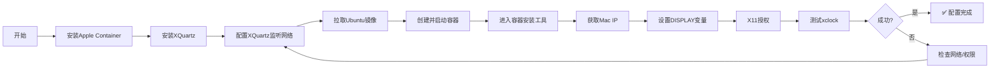

# Apple Container 完整配置指南：Ubuntu 22.04 安装与X11转发
本指南详细介绍了从零开始在Apple Silicon Mac上配置Apple Container并实现X11图形界面转发的完整流程。
## 📦 第一部分：容器安装与基础操作
### 1.1 安装Apple Container
Apple Container是Apple官方开源的容器化工具，专为Apple Silicon优化。
**安装步骤：**
1. 从GitHub官方仓库下载`.pkg`安装包
   - 访问：https://github.com/apple/container
   - 下载最新版本的`.pkg`文件
2. 双击`.pkg`文件，按照安装向导完成安装
3. 安装完成后，启动容器服务：
   ```bash
   container system start
   ```
4. 验证服务状态：
   ```bash
   container system status
   ```
### 1.2 拉取Ubuntu 22.04镜像
```bash
# 拉取Ubuntu 22.04官方镜像
container pull ubuntu:22.04
```
如果拉取失败，可能是网络或平台问题，可以尝试：
```bash
# 尝试拉取特定架构版本
container pull --platform linux/arm64 ubuntu:22.04
```
### 1.3 创建并启动容器
```bash
# 创建并启动名为ubuntu-x11的容器
container run -dit --name ubuntu-x11 ubuntu:22.04
# 查看容器列表
container ls -a
# 启动已停止的容器
container start ubuntu-x11
# 进入容器终端
container exec -it ubuntu-x11 /bin/bash
```
**参数说明：**
- `-d`：后台运行
- `-i`：交互式
- `-t`：分配伪终端
- `--name`：指定容器名称
### 1.4 容器基本操作命令
<details>
<summary>📖 常用容器命令参考</summary>
| 操作 | 命令 | 说明 |
|------|------|------|
| 查看运行容器 | `container ls` | 仅显示运行中的容器 |
| 查看所有容器 | `container ls -a` | 包括停止的容器 |
| 停止容器 | `container stop <名称>` | 停止运行中的容器 |
| 启动容器 | `container start <名称>` | 启动已停止的容器 |
| 删除容器 | `container rm <名称>` | 删除容器（需先停止） |
| 进入容器 | `container exec -it <名称> /bin/bash` | 在运行容器中执行命令 |
| 查看日志 | `container logs <名称>` | 查看容器输出日志 |
</details>
## 🖥️ 第二部分：X11转发配置
### 2.1 安装XQuartz（Mac端）
XQuartz是macOS上运行X11应用程序的必需组件。
**安装步骤：**
1. 访问 [XQuartz官网](https://www.xquartz.org/) 下载最新版本
2. 双击`.dmg`文件进行安装
3. 安装完成后注销并重新登录macOS
### 2.2 配置XQuartz网络监听（关键步骤）
默认情况下，XQuartz只监听本地连接，需要强制开启网络监听。
```bash
# 1. 彻底退出XQuartz（如果在运行）
killall XQuartz
# 2. 修改配置文件，允许TCP连接
defaults write org.xquartz.X11 nolisten_tcp -bool false
# 3. 重新启动XQuartz
open -a XQuartz
```
### 2.3 验证X11服务状态
```bash
# 检查6000端口是否监听
lsof -i :6000
```
**预期输出：**
```
COMMAND PID USER FD TYPE DEVICE SIZE/OFF NODE NAME
X11.bin 1234 user 10u IPv6 0x... 0t0 TCP *:6000 (LISTEN)
X11.bin 1234 user 11u IPv4 0x... 0t0 TCP *:6000 (LISTEN)
```
如果没有输出，说明配置未生效，请重新执行步骤2.2。
### 2.4 容器内环境配置
进入容器后，需要安装必要的软件包：
```bash
# 更新软件源
apt update
# 安装网络工具（包含ping）
apt install -y iputils-ping
# 安装X11应用程序（包含xclock测试工具）
apt install -y x11-apps
# 安装其他常用工具
apt install -y vim net-tools curl
```
### 2.5 网络配置与连接
**步骤1：获取Mac IP地址**
在**Mac终端**执行：
```bash
# 获取en0网卡的IP地址
ipconfig getifaddr en0
```
**步骤2：设置DISPLAY变量**
在**容器终端**执行：
```bash
# 设置DISPLAY变量（替换为实际Mac IP）
export DISPLAY=<Mac_IP>:0
# 例如：export DISPLAY=10.24.72.5:0
```
**步骤3：网络连通性测试**
在容器内测试与Mac的连通性：
```bash
# 测试网络连通性
ping -c 4 <Mac_IP>
# 查看容器网络配置
ifconfig -a
```
### 2.6 授权与测试
**步骤1：X11授权**
在**Mac终端**执行：
```bash
# 允许所有客户端连接（测试环境使用）
xhost +
```
**步骤2：测试X11转发**
在**容器终端**执行：
```bash
# 测试X11转发
xclock
```
如果看到时钟窗口弹出，说明配置成功！
## 🔧 完整配置流程图

## 🚀 快速启动脚本
为了方便日常使用，可以创建以下脚本：
**Mac端启动脚本** (`start_x11.sh`)：
```bash
#!/bin/bash
echo "=== 启动X11服务 ==="
# 检查XQuartz是否运行
if ! pgrep -x "XQuartz" > /dev/null; then
    echo "启动XQuartz..."
    open -a XQuartz
    sleep 3
fi
# 确保监听网络
defaults write org.xquartz.X11 nolisten_tcp -bool false
# 授权
echo "授权X11连接..."
xhost +
# 显示IP
MAC_IP=$(ipconfig getifaddr en0)
echo "Mac IP地址: $MAC_IP"
echo "请在容器内设置: export DISPLAY=$MAC_IP:0"
echo ""
echo "X11服务已启动，可以开始使用图形应用！"
```
**容器内环境设置脚本** (`setup_container.sh`)：
```bash
#!/bin/bash
# 容器内环境设置脚本
echo "=== 更新软件源 ==="
apt update
echo "=== 安装基础工具 ==="
apt install -y \
    iputils-ping \
    x11-apps \
    vim \
    net-tools \
    curl \
    git \
    build-essential
echo "=== 设置环境变量 ==="
# 提示用户设置DISPLAY
echo "请设置DISPLAY变量："
echo "export DISPLAY=<Mac_IP>:0"
echo ""
echo "容器环境设置完成！"
```
## ⚠️ 安全注意事项
1. **X11授权安全**：
   - `xhost +` 允许所有连接，仅用于测试环境
   - 生产环境应使用`.Xauthority`文件或SSH转发
2. **网络安全**：
   - 确保Mac防火墙配置正确
   - 避免在不受信任的网络环境中使用
3. **资源限制**：
   - 容器资源默认有限制，如需运行大型应用需调整
   - 可以使用`--memory`和`--cpus`参数限制资源
## 🔍 故障排除
<details>
<summary>📖 常见问题解决方案</summary>
| 问题 | 可能原因 | 解决方案 |
|------|----------|----------|
| `xclock` 无显示 | 网络不通 | 检查IP地址，使用`ping`测试 |
| `Authorization required` | 未授权 | 在Mac执行`xhost +` |
| `Can't open display` | DISPLAY变量错误 | 检查变量设置，确保IP正确 |
| XQuartz不监听6000端口 | 配置未生效 | 重新执行`defaults write`命令 |
| 容器内缺少命令 | 包未安装 | 使用`apt install`安装所需包 |
**详细排查步骤：**
1. **检查XQuartz状态**：
   ```bash
   lsof -i :6000
   ps aux | grep XQuartz
   ```
2. **检查网络连通性**：
   ```bash
   # 在容器内
   ping -c 4 <Mac_IP>
   ```
3. **检查环境变量**：
   ```bash
   # 在容器内
   echo $DISPLAY
   env | grep DISPLAY
   ```
4. **查看XQuartz日志**：
   ```bash
   # 在Mac终端
   log show --predicate 'process == "XQuartz"' --last 5m
   ```
</details>
## 📚 进阶配置
### 持久化DISPLAY设置
如果希望每次进入容器都自动设置DISPLAY，可以添加到容器配置：
```bash
# 在容器内创建启动脚本
cat > /etc/profile.d/x11.sh << 'EOF'
# 自动检测Mac IP并设置DISPLAY
if [ -z "$DISPLAY" ]; then
    # 尝试从路由表获取网关IP
    GATEWAY_IP=$(ip route | grep default | awk '{print $3}')
    if [ -n "$GATEWAY_IP" ]; then
        export DISPLAY=$GATEWAY_IP:0
    fi
fi
EOF
chmod +x /etc/profile.d/x11.sh
```
### 使用SSH X11转发（替代方案）
如果X11转发有问题，可以尝试SSH转发：
```bash
# 在Mac上安装SSH服务
brew install openssh
# 在容器内安装SSH客户端
apt install -y openssh-client
# 使用SSH X11转发
ssh -X user@<Mac_IP>
```
## 🎯 总结
本指南涵盖了从Apple Container安装到X11转发配置的完整流程。关键要点包括：
1. **XQuartz网络监听配置**是成功的关键
2. **正确的IP地址**和**DISPLAY变量设置**必不可少
3. **`xhost +`授权**解决了权限问题
4. **网络连通性测试**帮助排查问题
按照本指南操作，您应该能够在Apple Silicon Mac上成功运行Ubuntu容器并使用图形应用程序。
